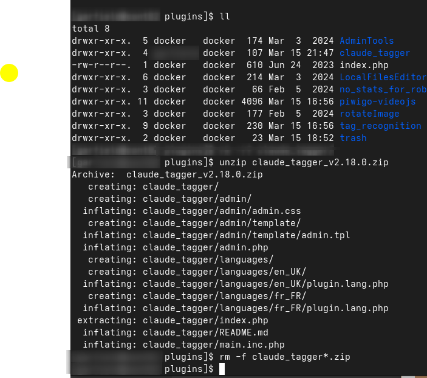
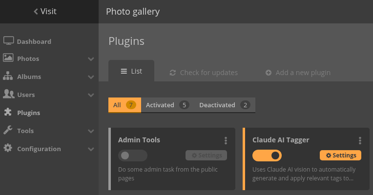
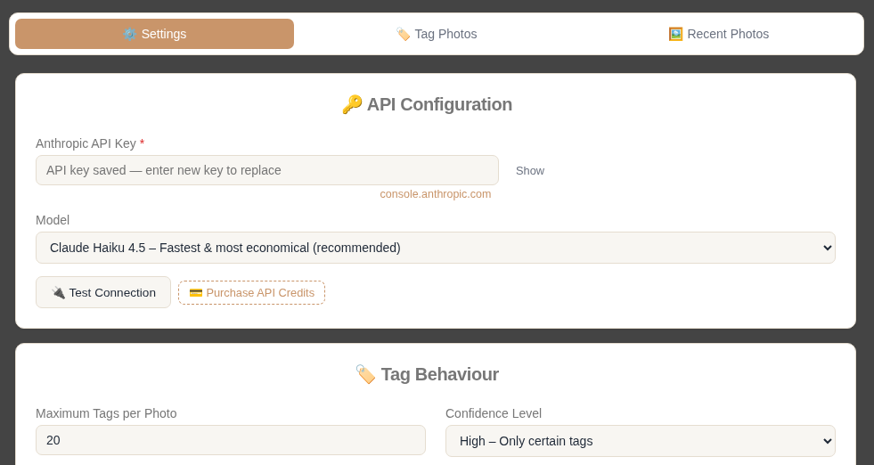
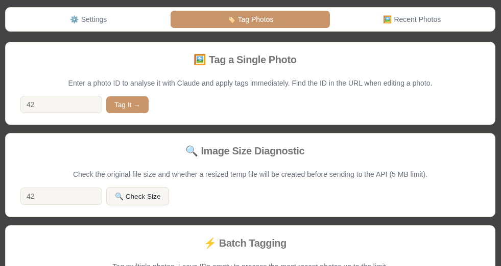
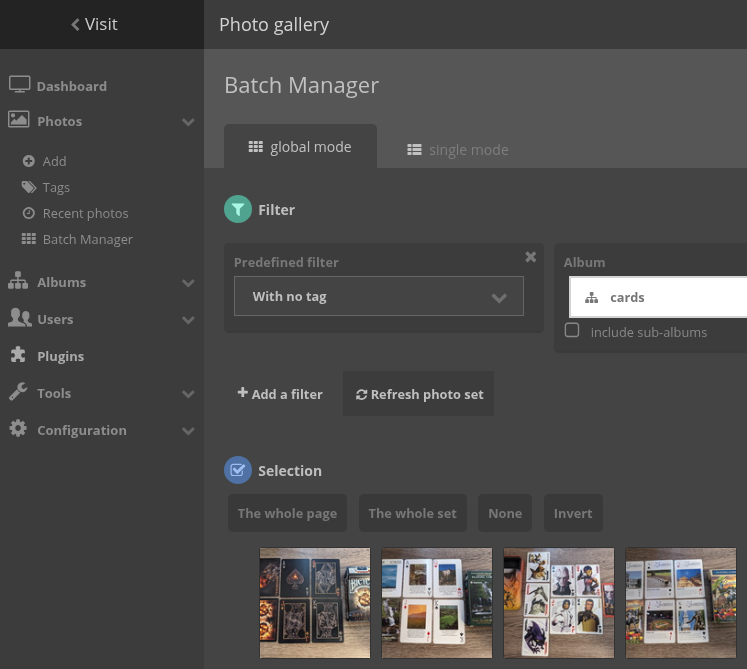
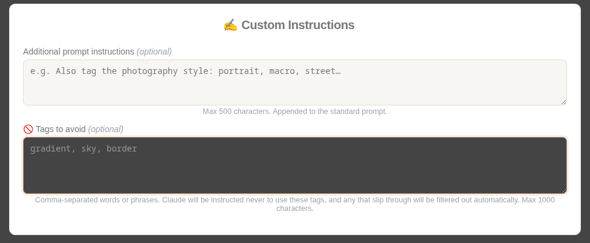

# Claude AI Tagger — Piwigo Plugin

Automatically analyse and tag your Piwigo photos using **Claude AI vision** (Anthropic). Detects objects, scenes, people, animals, logos, food, vehicles, nature, and more — then writes the tags directly into your gallery.

---

## Requirements

- **Piwigo** 13.x or 16.x (tested on 16.3) - Download from [https://www.piwigo.org/](https://www.piwigo.org/)
- **PHP** 7.4+ with the `curl` extension enabled
- **Anthropic API key** — get one free at [console.anthropic.com](https://console.anthropic.com)

## Alternative setup
- **Piwigo** Docker Container - Download from [https://hub.docker.com/r/linuxserver/piwigo](https://hub.docker.com/r/linuxserver/piwigo)
- **Anthropic API key** — get one free at [console.anthropic.com](https://console.anthropic.com)

---

## Installation

1. Copy the `claude_tagger` folder into your Piwigo `plugins/` directory.



2. In Piwigo admin go to **Plugins → Manage** and activate **Claude AI Tagger**.



3. Go to **Plugins → Claude AI Tagger** and paste your API key, then click **Save Settings**.



---

## Models

| Model | API ID | Best for |
|---|---|---|
| **Claude Haiku 4.5** ✅ recommended | `claude-haiku-4-5-20251001` | Photo tagging — fast, cheap, accurate |
| Claude Sonnet 4.5 | `claude-sonnet-4-5-20250929` | Richer descriptions, higher cost |
| Claude Opus 4.5 | `claude-opus-4-5-20251101` | Maximum detail, highest cost |

Haiku 4.5 is the default and recommended choice for tagging. It supports vision, runs fast, and costs ~$1 per million input tokens.

> **Important:** The API requires the full snapshot-dated model ID (e.g. `claude-haiku-4-5-20251001`). Short aliases will be rejected.

---

## Configuration

| Setting | Description |
|---|---|
| API Key | Your `sk-ant-...` key from Anthropic Console |
| Model | Which Claude model to use (Haiku recommended) |
| Auto-tag on upload | Tag every new photo automatically |
| Max tags | 1–50 tags per image (default 20) |
| Confidence level | Low / Medium / High |
| Tag language | ISO 639-1 code, e.g. `en`, `fr`, `de` |
| Tag prefix | Optional prefix, e.g. `ai:` |
| Create new tags | Create tags that don't yet exist in Piwigo |
| Overwrite existing tags | Remove old tags before adding new ones |
| Custom instructions | Extra text appended to the tagging prompt |

### Tag Categories

Enable or disable detection for: Objects, Scenes, People/Faces, Actions, Colors, Mood, Text/OCR, Logos, Animals, Food, Vehicles, Nature.

---

## Usage



### Single photo
Go to **Tag Photos → Tag a Single Photo**, enter the photo's numeric ID (visible in the URL when editing a photo, e.g. `?page=photo&image_id=42`), and click **Tag It**.

### Batch tagging
Go to **Tag Photos → Batch Tagging**. Leave the ID field empty to process the most recent N photos, or enter a comma-separated list of IDs. A 300 ms delay is applied between requests to respect API rate limits.

The easier way to use Batch Tagging is to use Piwigo's Batch Manager, use the search filter for "with no tag", hover over the image, and click "Edit photo" ( pencil icon ). You will find the ID number at the top saying "Edit photo #99999" ( replace 99999 with your image ID ). Copy this number into the Batch Tagging box, add up to 20 IDs separated by commas.



### Auto-tag on upload
Enable **Auto-tag on upload** in Settings. Every photo added via the Piwigo uploader will be tagged automatically.


### List of words to avoid for tags
There are times when AI generates photo tags that are useless. Thank you, "Captian Obvious"! This feature allows you to add a list of words that AI won't use for tags.



---

## Diagnostic fields

The Settings page shows two read-only fields below the model dropdown:

- **Resolved by plugin** — the model ID that the plugin will actually use for API calls.
- **Stored in database** — the raw model ID read directly from Piwigo's config table.

Both should show the same full snapshot ID (e.g. `claude-haiku-4-5-20251001`). If they differ or show a short alias, save Settings again to correct the stored value.

---

## Troubleshooting

| Error | Likely cause |
|---|---|
| "Not enough credits" or "invalid model" | You need API credits - Click the "Purchase API Credits button to add credits to your account |
| "File not found" | Photo stored remotely or path incorrect |
| Tags not appearing | Ensure **Create New Tags** is enabled |
| Batch very slow | Normal — 300 ms delay per request is intentional |

---

## File structure

```
claude_tagger/
├── main.inc.php              ← Plugin entry point, hooks, core API logic
├── admin.php                 ← Admin controller (POST handlers, config)
├── index.php                 ← Security stub
├── admin/
│   ├── admin.css             ← Admin stylesheet
│   └── template/
│       └── admin.tpl         ← Smarty admin template
└── languages/
    ├── en_UK/plugin.lang.php
    └── fr_FR/plugin.lang.php
```

---

## Changelog

| Version | Notes |
|---|---|
| 2.17.0 | First functioning release |
| 2.6.0 | Add diagnostic model ID fields to settings page |
| 2.5.0 | Stale model ID auto-migration; Haiku as default |
| 2.4.0 | Fix model IDs to full snapshot strings |
| 2.3.0 | Update to Claude 4.5/4.6 model family |
| 2.2.0 | Fix Smarty 5 `basename`/`split` modifier errors |
| 2.1.0 | Switch to Piwigo template engine to fix grayed-out button |
| 2.0.0 | Piwigo 16 compatibility; remove bogus directory |
| 1.0.0 | Initial release |

---

## License

MIT
